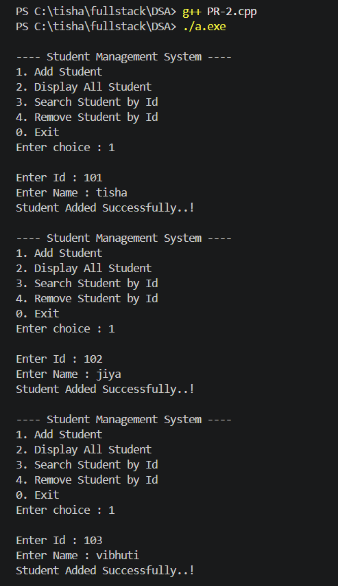
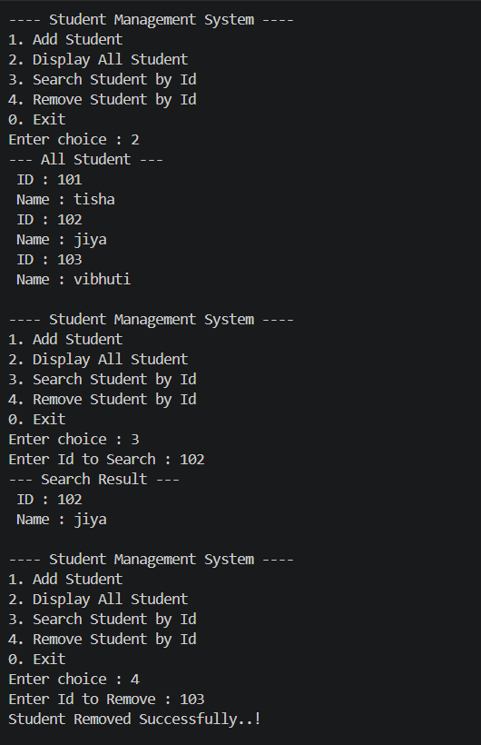
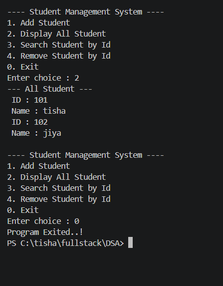

# 📚 Student Management System (C++)

## 📌 Project Description

This is a simple **Student Management System** developed in **C++** using **Vectors and Templates**.
The program allows users to perform basic operations like adding, displaying, searching, and removing student records through a menu-driven interface.

---

## 🚀 Features

* ➕ Add Student
* 📋 Display All Students
* 🔍 Search Student by ID
* ❌ Remove Student by ID
* 🚪 Exit Program

---

## 🛠️ Technologies Used

* C++ Programming Language
* STL (Standard Template Library)

  * `vector`

---

## 🧠 Concepts Used

* Class Template
* Object-Oriented Programming (OOP)
* Dynamic Data Storage using Vector
* Looping and Conditional Statements

---

## 📂 Class Structure

### 🔹 Template Class: `student<T>`

#### Attributes:

* `id` → Student ID
* `name` → Student Name

#### Methods:

* Constructor → Initializes student details
* `display()` → Prints student information

---

## ⚙️ How It Works

1. The program displays a menu.
2. User selects an operation.
3. Based on choice:

   * Student is added to vector
   * All students are displayed
   * Search is performed using ID
   * Student is removed using ID
4. Program continues until user selects Exit.

---

## ▶️ How to Run

### Step 1: Compile

```bash
g++ PR-2.cpp
```

### Step 2: Run

```bash
./a.exe
```

---

## 📷 Output Screenshots

### ➕ Add Student


### 📋 Display Students


### 🔍 Search Student


---

## 📊 Example Operations

* Add Students:
  * ID: 101 → tisha
  * ID: 102 → jiya
  * ID: 103 → vibhuti

* Display: Shows all students

* Search:
  * Input: 102
  * Output: jiya

* Remove:
  * Input: 103
  * Output: Student Removed Successfully

---

## 👩‍💻 Author

**Tisha Mali**

---

## 📌 Conclusion

This project demonstrates basic CRUD operations using C++ and helps in understanding how data can be managed dynamically using vectors and templates.

---
